## Generate Github Token Token

[Generate a token](https://github.com/settings/tokens/new) with scope _Access public repositories_ `public_repo`.

## Run

Run with:

```
GITHUB_TOKEN=ghp_.... ./gradlew run  
```

Will print module name (in green if master is on 4.0.0-SNAPSHOT), a tick if the latest Java CI is passing (a cross if failing), and the version of micronaut that the master branch is using. 

---

### Run at Sun, 15 Jan 2023 06:07:42 GMT

| | Repository | Project Version | Settings Version | Status | Micronaut Version |
| --- | --- | --- | --- | --- | --- |
| 💚 | [micronaut-acme](https://github.com/micronaut-projects/micronaut-acme) | 4.0.0-SNAPSHOT | ✅ 6.1.1 | [](https://github.com/micronaut-projects/micronaut-acme/actions) | ✅ 4.0.0-SNAPSHOT |
| 💚 | [micronaut-aot](https://github.com/micronaut-projects/micronaut-aot) | 2.0.0-SNAPSHOT | ✅ 6.1.1 | [](https://github.com/micronaut-projects/micronaut-aot/actions) | ✅ 4.0.0-SNAPSHOT |
|  | [micronaut-aws](https://github.com/micronaut-projects/micronaut-aws) | 4.0.0-SNAPSHOT |  5.3.16 | [](https://github.com/micronaut-projects/micronaut-aws/actions) |  3.8.0 |
|  | [micronaut-azure](https://github.com/micronaut-projects/micronaut-azure) | 5.0.0-SNAPSHOT | ✅ 6.1.1 | [](https://github.com/micronaut-projects/micronaut-azure/actions) | ✅ 4.0.0-SNAPSHOT |
| 💚 | [micronaut-cache](https://github.com/micronaut-projects/micronaut-cache) | 4.0.0-SNAPSHOT | ✅ 6.1.1 | [](https://github.com/micronaut-projects/micronaut-cache/actions) | ✅ 4.0.0-SNAPSHOT |
|  | [micronaut-camel](https://github.com/micronaut-projects/micronaut-camel) | 1.0.0-SNAPSHOT |  unknown | [](https://github.com/micronaut-projects/micronaut-camel/actions) |  2.0.2 |
| 💚 | [micronaut-cassandra](https://github.com/micronaut-projects/micronaut-cassandra) | 6.0.0-SNAPSHOT | ✅ 6.1.1 | [](https://github.com/micronaut-projects/micronaut-cassandra/actions) | ✅ 4.0.0-SNAPSHOT |
|  | [micronaut-chatbots](https://github.com/micronaut-projects/micronaut-chatbots) | 1.0.0-SNAPSHOT |  5.3.14 | [](https://github.com/micronaut-projects/micronaut-chatbots/actions) |  3.6.0 |
|  | [micronaut-coherence](https://github.com/micronaut-projects/micronaut-coherence) | 3.8.0-SNAPSHOT | ✅ 6.1.1 | [](https://github.com/micronaut-projects/micronaut-coherence/actions) |  3.8.0 |
|  | [micronaut-couchbase](https://github.com/micronaut-projects/micronaut-couchbase) | 1.0.0.BUILD-SNAPSHOT |  unknown | [](https://github.com/micronaut-projects/micronaut-couchbase/actions) |  1.1.0 |
| 💚 | [micronaut-crac](https://github.com/micronaut-projects/micronaut-crac) | 2.0.0-SNAPSHOT | ✅ 6.1.1 | [](https://github.com/micronaut-projects/micronaut-crac/actions) | ✅ 4.0.0-SNAPSHOT |
| 💚 | [micronaut-data](https://github.com/micronaut-projects/micronaut-data) | 4.0.0-SNAPSHOT | ✅ 6.1.1 | [](https://github.com/micronaut-projects/micronaut-data/actions) | ✅ 4.0.0-SNAPSHOT |
| 💚 | [micronaut-discovery-client](https://github.com/micronaut-projects/micronaut-discovery-client) | 4.0.0-SNAPSHOT | ✅ 6.1.1 | [](https://github.com/micronaut-projects/micronaut-discovery-client/actions) | ✅ 4.0.0-SNAPSHOT |
| 💚 | [micronaut-elasticsearch](https://github.com/micronaut-projects/micronaut-elasticsearch) | 5.0.0-SNAPSHOT | ✅ 6.1.1 | [](https://github.com/micronaut-projects/micronaut-elasticsearch/actions) | ✅ 4.0.0-SNAPSHOT |
| 💚 | [micronaut-email](https://github.com/micronaut-projects/micronaut-email) | 2.0.0-SNAPSHOT | ✅ 6.1.1 | [](https://github.com/micronaut-projects/micronaut-email/actions) | ✅ 4.0.0-SNAPSHOT |
| 💚 | [micronaut-flyway](https://github.com/micronaut-projects/micronaut-flyway) | 6.0.0-SNAPSHOT | ✅ 6.1.1 | [](https://github.com/micronaut-projects/micronaut-flyway/actions) | ✅ 4.0.0-SNAPSHOT |
| 💚 | [micronaut-gcp](https://github.com/micronaut-projects/micronaut-gcp) | 5.0.0-SNAPSHOT | ✅ 6.1.1 | [](https://github.com/micronaut-projects/micronaut-gcp/actions) | ✅ 4.0.0-SNAPSHOT |
| 💚 | [micronaut-gradle-plugin](https://github.com/micronaut-projects/micronaut-gradle-plugin) | 4.0.0-SNAPSHOT | ✅ 6.1.1 | [](https://github.com/micronaut-projects/micronaut-gradle-plugin/actions) | ✅ 4.0.0-SNAPSHOT |
| 💚 | [micronaut-graphql](https://github.com/micronaut-projects/micronaut-graphql) | 4.0.0-SNAPSHOT | ✅ 6.1.1 | [](https://github.com/micronaut-projects/micronaut-graphql/actions) | ✅ 4.0.0-SNAPSHOT |
| 💚 | [micronaut-groovy](https://github.com/micronaut-projects/micronaut-groovy) | 4.0.0-SNAPSHOT | ✅ 6.1.1 | [](https://github.com/micronaut-projects/micronaut-groovy/actions) | ✅ 4.0.0-SNAPSHOT |
| 💚 | [micronaut-grpc](https://github.com/micronaut-projects/micronaut-grpc) | 4.0.0-SNAPSHOT | ✅ 6.1.1 | [](https://github.com/micronaut-projects/micronaut-grpc/actions) | ✅ 4.0.0-SNAPSHOT |
| 💚 | [micronaut-hibernate-validator](https://github.com/micronaut-projects/micronaut-hibernate-validator) | 4.0.0-SNAPSHOT | ✅ 6.1.1 | [](https://github.com/micronaut-projects/micronaut-hibernate-validator/actions) | ✅ 4.0.0-SNAPSHOT |
|  | [micronaut-ignite](https://github.com/micronaut-projects/micronaut-ignite) | 1.0.0.BUILD-SNAPSHOT |  unknown | [](https://github.com/micronaut-projects/micronaut-ignite/actions) |  2.0.1 |
| 💚 | [micronaut-jackson-xml](https://github.com/micronaut-projects/micronaut-jackson-xml) | 4.0.0-SNAPSHOT | ✅ 6.1.1 | [](https://github.com/micronaut-projects/micronaut-jackson-xml/actions) | ✅ 4.0.0-SNAPSHOT |
| 💚 | [micronaut-jaxrs](https://github.com/micronaut-projects/micronaut-jaxrs) | 4.0.0-SNAPSHOT | ✅ 6.1.1 | [](https://github.com/micronaut-projects/micronaut-jaxrs/actions) | ✅ 4.0.0-SNAPSHOT |
|  | [micronaut-jms](https://github.com/micronaut-projects/micronaut-jms) | 3.0.0-SNAPSHOT |  6.1.0 | [](https://github.com/micronaut-projects/micronaut-jms/actions) |  3.7.4 |
| 💚 | [micronaut-jmx](https://github.com/micronaut-projects/micronaut-jmx) | 4.0.0-SNAPSHOT | ✅ 6.1.1 | [](https://github.com/micronaut-projects/micronaut-jmx/actions) | ✅ 4.0.0-SNAPSHOT |
| 💚 | [micronaut-kafka](https://github.com/micronaut-projects/micronaut-kafka) | 5.0.0-SNAPSHOT | ✅ 6.1.1 | [](https://github.com/micronaut-projects/micronaut-kafka/actions) | ✅ 4.0.0-SNAPSHOT |
| 💚 | [micronaut-kotlin](https://github.com/micronaut-projects/micronaut-kotlin) | 4.0.0-SNAPSHOT | ✅ 6.1.1 | [](https://github.com/micronaut-projects/micronaut-kotlin/actions) | ✅ 4.0.0-SNAPSHOT |
|  | [micronaut-kubernetes](https://github.com/micronaut-projects/micronaut-kubernetes) | 3.4.1-SNAPSHOT |  5.2.3 | [](https://github.com/micronaut-projects/micronaut-kubernetes/actions) |  3.3.4 |
| 💚 | [micronaut-liquibase](https://github.com/micronaut-projects/micronaut-liquibase) | 6.0.0-SNAPSHOT | ✅ 6.1.1 | [](https://github.com/micronaut-projects/micronaut-liquibase/actions) | ✅ 4.0.0-SNAPSHOT |
|  | [micronaut-maven-plugin](https://github.com/micronaut-projects/micronaut-maven-plugin) | unknown |  unknown | [](https://github.com/micronaut-projects/micronaut-maven-plugin/actions) |  null |
| 💚 | [micronaut-micrometer](https://github.com/micronaut-projects/micronaut-micrometer) | 5.0.0-SNAPSHOT | ✅ 6.1.1 | [](https://github.com/micronaut-projects/micronaut-micrometer/actions) | ✅ 4.0.0-SNAPSHOT |
| 💚 | [micronaut-microstream](https://github.com/micronaut-projects/micronaut-microstream) | 2.0.0-SNAPSHOT | ✅ 6.1.1 | [](https://github.com/micronaut-projects/micronaut-microstream/actions) | ✅ 4.0.0-SNAPSHOT |
| 💚 | [micronaut-mongodb](https://github.com/micronaut-projects/micronaut-mongodb) | 5.0.0-SNAPSHOT | ✅ 6.1.1 | [](https://github.com/micronaut-projects/micronaut-mongodb/actions) | ✅ 4.0.0-SNAPSHOT |
| 💚 | [micronaut-mqtt](https://github.com/micronaut-projects/micronaut-mqtt) | 3.0.0-SNAPSHOT | ✅ 6.1.1 | [](https://github.com/micronaut-projects/micronaut-mqtt/actions) | ✅ 4.0.0-SNAPSHOT |
| 💚 | [micronaut-multitenancy](https://github.com/micronaut-projects/micronaut-multitenancy) | 5.0.0-SNAPSHOT | ✅ 6.1.1 | [](https://github.com/micronaut-projects/micronaut-multitenancy/actions) | ✅ 4.0.0-SNAPSHOT |
| 💚 | [micronaut-nats](https://github.com/micronaut-projects/micronaut-nats) | 4.0.0-SNAPSHOT | ✅ 6.1.1 | [](https://github.com/micronaut-projects/micronaut-nats/actions) | ✅ 4.0.0-SNAPSHOT |
| 💚 | [micronaut-neo4j](https://github.com/micronaut-projects/micronaut-neo4j) | 6.0.0-SNAPSHOT | ✅ 6.1.1 | [](https://github.com/micronaut-projects/micronaut-neo4j/actions) | ✅ 4.0.0-SNAPSHOT |
|  | [micronaut-object-storage](https://github.com/micronaut-projects/micronaut-object-storage) | 4.0.0-SNAPSHOT |  5.3.16 | [](https://github.com/micronaut-projects/micronaut-object-storage/actions) |  3.7.0 |
| 💚 | [micronaut-openapi](https://github.com/micronaut-projects/micronaut-openapi) | 5.0.0-SNAPSHOT | ✅ 6.1.1 | [](https://github.com/micronaut-projects/micronaut-openapi/actions) | ✅ 4.0.0-SNAPSHOT |
|  | [micronaut-oracle-cloud](https://github.com/micronaut-projects/micronaut-oracle-cloud) | 2.3.2-SNAPSHOT |  5.3.14 | [](https://github.com/micronaut-projects/micronaut-oracle-cloud/actions) |  3.7.2 |
| 💚 | [micronaut-picocli](https://github.com/micronaut-projects/micronaut-picocli) | 5.0.0-SNAPSHOT | ✅ 6.1.1 | [](https://github.com/micronaut-projects/micronaut-picocli/actions) | ✅ 4.0.0-SNAPSHOT |
|  | [micronaut-platform](https://github.com/micronaut-projects/micronaut-platform) | 4.0.0-SNAPSHOT | ✅ 6.1.1 | [](https://github.com/micronaut-projects/micronaut-platform/actions) |  UNKNOWN |
| 💚 | [micronaut-problem-json](https://github.com/micronaut-projects/micronaut-problem-json) | 3.0.0-SNAPSHOT | ✅ 6.1.1 | [](https://github.com/micronaut-projects/micronaut-problem-json/actions) | ✅ 4.0.0-SNAPSHOT |
|  | [micronaut-pulsar](https://github.com/micronaut-projects/micronaut-pulsar) | 1.2.2-SNAPSHOT |  5.3.14 | [](https://github.com/micronaut-projects/micronaut-pulsar/actions) |  3.3.1 |
| 💚 | [micronaut-r2dbc](https://github.com/micronaut-projects/micronaut-r2dbc) | 5.0.0-SNAPSHOT | ✅ 6.1.1 | [](https://github.com/micronaut-projects/micronaut-r2dbc/actions) | ✅ 4.0.0-SNAPSHOT |
| 💚 | [micronaut-rabbitmq](https://github.com/micronaut-projects/micronaut-rabbitmq) | 4.0.0-SNAPSHOT | ✅ 6.1.1 | [](https://github.com/micronaut-projects/micronaut-rabbitmq/actions) | ✅ 4.0.0-SNAPSHOT |
| 💚 | [micronaut-reactor](https://github.com/micronaut-projects/micronaut-reactor) | 3.0.0-SNAPSHOT | ✅ 6.1.1 | [](https://github.com/micronaut-projects/micronaut-reactor/actions) | ✅ 4.0.0-SNAPSHOT |
| 💚 | [micronaut-redis](https://github.com/micronaut-projects/micronaut-redis) | 6.0.0-SNAPSHOT | ✅ 6.1.1 | [](https://github.com/micronaut-projects/micronaut-redis/actions) | ✅ 4.0.0-SNAPSHOT |
| 💚 | [micronaut-rss](https://github.com/micronaut-projects/micronaut-rss) | 4.0.0-SNAPSHOT | ✅ 6.1.1 | [](https://github.com/micronaut-projects/micronaut-rss/actions) | ✅ 4.0.0-SNAPSHOT |
| 💚 | [micronaut-rxjava2](https://github.com/micronaut-projects/micronaut-rxjava2) | 2.0.0-SNAPSHOT | ✅ 6.1.1 | [](https://github.com/micronaut-projects/micronaut-rxjava2/actions) | ✅ 4.0.0-SNAPSHOT |
| 💚 | [micronaut-rxjava3](https://github.com/micronaut-projects/micronaut-rxjava3) | 3.0.0-SNAPSHOT | ✅ 6.1.1 | [](https://github.com/micronaut-projects/micronaut-rxjava3/actions) | ✅ 4.0.0-SNAPSHOT |
| 💚 | [micronaut-security](https://github.com/micronaut-projects/micronaut-security) | 4.0.0-SNAPSHOT | ✅ 6.1.1 | [](https://github.com/micronaut-projects/micronaut-security/actions) | ✅ 4.0.0-SNAPSHOT |
| 💚 | [micronaut-serialization](https://github.com/micronaut-projects/micronaut-serialization) | 2.0.0-SNAPSHOT | ✅ 6.1.1 | [](https://github.com/micronaut-projects/micronaut-serialization/actions) | ✅ 4.0.0-SNAPSHOT |
| 💚 | [micronaut-servlet](https://github.com/micronaut-projects/micronaut-servlet) | 4.0.0-SNAPSHOT | ✅ 6.1.1 | [](https://github.com/micronaut-projects/micronaut-servlet/actions) | ✅ 4.0.0-SNAPSHOT |
| 💚 | [micronaut-session](https://github.com/micronaut-projects/micronaut-session) | 1.0.0-SNAPSHOT | ✅ 6.1.1 | [](https://github.com/micronaut-projects/micronaut-session/actions) | ✅ 4.0.0-SNAPSHOT |
| 💚 | [micronaut-spring](https://github.com/micronaut-projects/micronaut-spring) | 5.0.0-SNAPSHOT | ✅ 6.1.1 | [](https://github.com/micronaut-projects/micronaut-spring/actions) | ✅ 4.0.0-SNAPSHOT |
| 💚 | [micronaut-sql](https://github.com/micronaut-projects/micronaut-sql) | 5.0.0-SNAPSHOT | ✅ 6.1.1 | [](https://github.com/micronaut-projects/micronaut-sql/actions) | ✅ 4.0.0-SNAPSHOT |
|  | [micronaut-starter](https://github.com/micronaut-projects/micronaut-starter) | 3.8.2-SNAPSHOT |  5.3.16 | [](https://github.com/micronaut-projects/micronaut-starter/actions) |  3.8.2-SNAPSHOT |
| 💚 | [micronaut-test](https://github.com/micronaut-projects/micronaut-test) | 4.0.0-SNAPSHOT | ✅ 6.1.1 | [](https://github.com/micronaut-projects/micronaut-test/actions) | ✅ 4.0.0-SNAPSHOT |
|  | [micronaut-test-resources](https://github.com/micronaut-projects/micronaut-test-resources) | 2.0.0-SNAPSHOT | ✅ 6.1.1 | [](https://github.com/micronaut-projects/micronaut-test-resources/actions) | ✅ 4.0.0-SNAPSHOT |
| 💚 | [micronaut-toml](https://github.com/micronaut-projects/micronaut-toml) | 2.0.0-SNAPSHOT | ✅ 6.1.1 | [](https://github.com/micronaut-projects/micronaut-toml/actions) | ✅ 4.0.0-SNAPSHOT |
|  | [micronaut-tracing](https://github.com/micronaut-projects/micronaut-tracing) | 5.0.0-SNAPSHOT |  6.0.1 | [](https://github.com/micronaut-projects/micronaut-tracing/actions) |  3.7.3 |
|  | [micronaut-validation](https://github.com/micronaut-projects/micronaut-validation) | 4.0.0-SNAPSHOT |  6.1.0 | [](https://github.com/micronaut-projects/micronaut-validation/actions) | ✅ 4.0.0-SNAPSHOT |
|  | [micronaut-views](https://github.com/micronaut-projects/micronaut-views) | 4.0.0-SNAPSHOT | ✅ 6.1.1 | [](https://github.com/micronaut-projects/micronaut-views/actions) | ✅ 4.0.0-SNAPSHOT |

---
### Experimental dependency graph

Only includes repositories that use importMicronautCatalog, and excludes micronaut-core as that's a given.
Directly reciprocal dependencies are marked in red.

```mermaid
graph LR
    micronaut-test -------> micronaut-data
    micronaut-test -------------------------------> micronaut-serde
    micronaut-test ----> micronaut-spring
    micronaut-test ---------> micronaut-sql
    micronaut-kotlin ---------------> micronaut-reactor
    micronaut-spring --------> micronaut-cache
    micronaut-spring ----> micronaut-views
    micronaut-liquibase -------------------------------> micronaut-serde
    micronaut-liquibase ---------> micronaut-sql
    micronaut-flyway ---------> micronaut-sql
    micronaut-elasticsearch --------> micronaut-security
    micronaut-graphql -----> micronaut-kotlin
    micronaut-graphql --------> micronaut-security
    micronaut-grpc ---------------> micronaut-reactor
    micronaut-grpc -----> micronaut-tracing
    micronaut-kafka --------> micronaut-cache
    micronaut-kafka --------> micronaut-micrometer
    micronaut-kafka ---------------> micronaut-reactor
    micronaut-kafka --------> micronaut-rxjava2
    micronaut-kafka -------------------------------> micronaut-serde
    micronaut-kafka -----> micronaut-tracing
    micronaut-micrometer --------> micronaut-cache
    micronaut-micrometer -----> micronaut-r2dbc
    micronaut-micrometer --------> micronaut-rxjava2
    micronaut-micrometer -------------------------------> micronaut-serde
    micronaut-micrometer ---------> micronaut-sql
    micronaut-sql --------> micronaut-cache
    micronaut-sql -------> micronaut-data
    micronaut-sql --------> micronaut-micrometer
    micronaut-sql ---------------> micronaut-reactor
    micronaut-sql -----> micronaut-r2dbc
    micronaut-sql -------------------------------> micronaut-serde
    micronaut-sql ----> micronaut-spring
    micronaut-sql ---> micronaut-test
    micronaut-mongodb --------> micronaut-micrometer
    micronaut-mongodb -------------------------------> micronaut-serde
    micronaut-redis --------> micronaut-cache
    micronaut-redis --------> micronaut-micrometer
    micronaut-redis -------------------------------> micronaut-serde
    micronaut-redis -----> micronaut-session
    micronaut-rabbitmq --------> micronaut-micrometer
    micronaut-rabbitmq -------------------------------> micronaut-serde
    micronaut-rss -------------------------------> micronaut-serde
    micronaut-gcp --------> micronaut-rxjava2
    micronaut-gcp -------------------------------> micronaut-serde
    micronaut-gcp ----> micronaut-servlet
    micronaut-gcp -----> micronaut-tracing
    micronaut-acme -------------------------------> micronaut-serde
    micronaut-openapi --------> micronaut-security
    micronaut-openapi -------------------------------> micronaut-serde
    micronaut-openapi --------> micronaut-rxjava2
    micronaut-openapi --> micronaut-rxjava3
    micronaut-openapi --> micronaut-groovy
    micronaut-openapi --> micronaut-validation
    micronaut-openapi -------> micronaut-data
    micronaut-openapi ---> micronaut-test
    micronaut-openapi -----> micronaut-kotlin
    micronaut-security ---> micronaut-multitenancy
    micronaut-security ---------------> micronaut-reactor
    micronaut-security -------------------------------> micronaut-serde
    micronaut-security ----> micronaut-servlet
    micronaut-security -----> micronaut-session
    micronaut-security ----> micronaut-views
    micronaut-views --------> micronaut-security
    micronaut-views -------------------------------> micronaut-serde
    micronaut-hibernate-validator -------------------------------> micronaut-serde
    micronaut-data ---------------> micronaut-reactor
    micronaut-data --------> micronaut-rxjava2
    micronaut-data -----> micronaut-r2dbc
    micronaut-data ----> micronaut-spring
    micronaut-data -------------------------------> micronaut-serde
    micronaut-data ---------> micronaut-sql
    micronaut-data -----> micronaut-kotlin
    micronaut-data ---> micronaut-multitenancy
    micronaut-cache -------------------------------> micronaut-serde
    micronaut-nats --------> micronaut-micrometer
    micronaut-nats ---------------> micronaut-reactor
    micronaut-nats -------------------------------> micronaut-serde
    micronaut-jaxrs --------> micronaut-security
    micronaut-jaxrs -------------------------------> micronaut-serde
    micronaut-servlet ---------------> micronaut-reactor
    micronaut-servlet --------> micronaut-security
    micronaut-servlet -----> micronaut-session
    micronaut-rxjava3 --------> micronaut-rxjava2
    micronaut-reactor -----> micronaut-tracing
    micronaut-reactor -------------------------------> micronaut-serde
    micronaut-azure ---------------> micronaut-reactor
    micronaut-azure -------------------------------> micronaut-serde
    micronaut-azure ----> micronaut-servlet
    micronaut-mqtt -------------------------------> micronaut-serde
    micronaut-r2dbc ---------------> micronaut-reactor
    micronaut-r2dbc --------> micronaut-rxjava2
    micronaut-r2dbc -------------------------------> micronaut-serde
    micronaut-r2dbc -----> micronaut-kotlin
    micronaut-r2dbc -------> micronaut-data
    micronaut-r2dbc ---------> micronaut-sql
    micronaut-r2dbc --> micronaut-flyway
    micronaut-multitenancy -------------------------------> micronaut-serde
    micronaut-multitenancy ---------------> micronaut-reactor
    micronaut-multitenancy -----> micronaut-session
    micronaut-problem-json -------------------------------> micronaut-serde
    micronaut-aot --> micronaut-picocli
    micronaut-serialization ---------------> micronaut-reactor
    micronaut-email --> micronaut-aws
    micronaut-email ---------------> micronaut-reactor
    micronaut-email -------------------------------> micronaut-serde
    micronaut-email ----> micronaut-views
    micronaut-microstream --------> micronaut-cache
    micronaut-microstream --------> micronaut-micrometer
    micronaut-microstream -------------------------------> micronaut-serde
    micronaut-test-resources -------> micronaut-data
    micronaut-test-resources --> micronaut-elasticsearch
    micronaut-test-resources --> micronaut-email
    micronaut-test-resources --> micronaut-kafka
    micronaut-test-resources --> micronaut-mongodb
    micronaut-test-resources --> micronaut-mqtt
    micronaut-test-resources --> micronaut-neo4j
    micronaut-test-resources --> micronaut-rabbitmq
    micronaut-test-resources ---------------> micronaut-reactor
    micronaut-test-resources --> micronaut-redis
    micronaut-test-resources -----> micronaut-r2dbc
    micronaut-test-resources --------> micronaut-security
    micronaut-test-resources -------------------------------> micronaut-serde
    micronaut-test-resources ---------> micronaut-sql
    micronaut-crac -------> micronaut-data
    micronaut-crac -------------------------------> micronaut-serde
    micronaut-crac ---------> micronaut-sql
    micronaut-session --------> micronaut-cache
    micronaut-session -------------------------------> micronaut-serde
    linkStyle 3,25,27,28,30,33,60,62,63,68,71,81,94,95 stroke:red, stroke-width:4px
```


